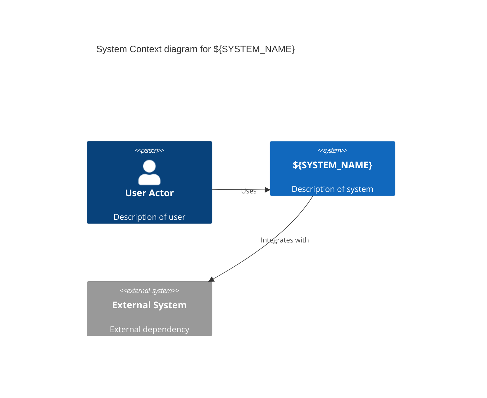
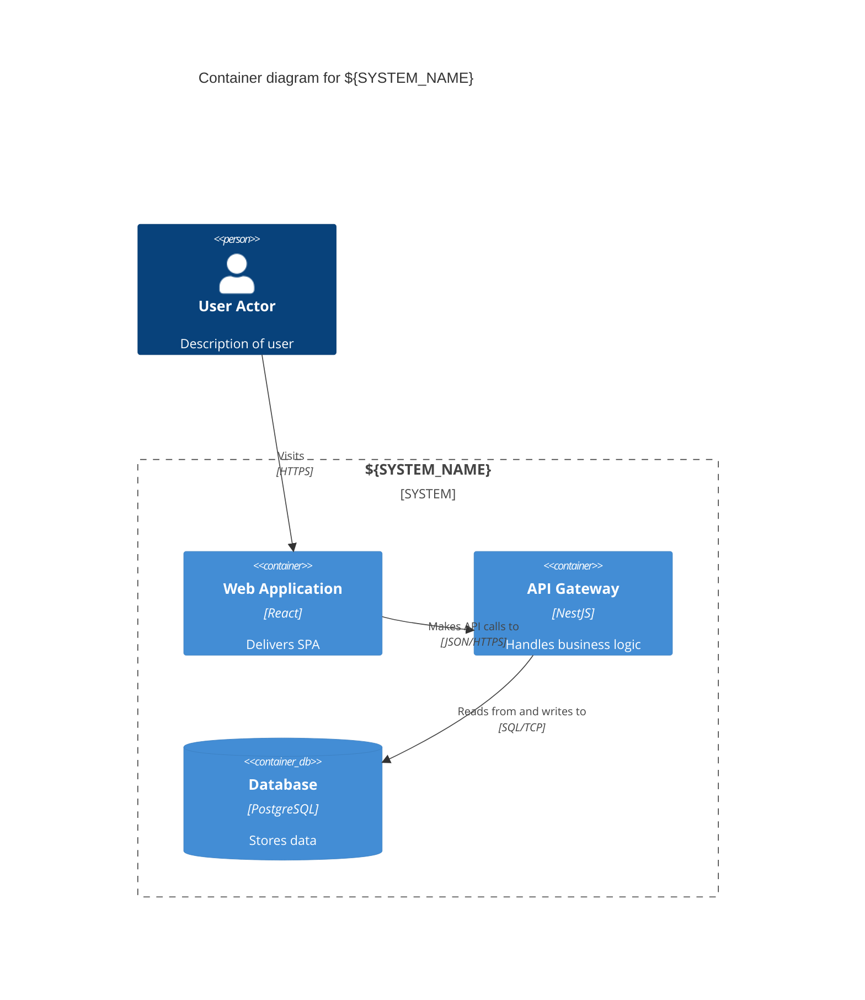

# Strategic Design (C4 Model)
*Version: ${VERSION}*

## Context Diagram (Level 1)

```mermaid
C4Context
  title System Context diagram for ${SYSTEM_NAME}
  
  Person(user, "User Actor", "Description of user")
  System(system, "${SYSTEM_NAME}", "Description of system")
  System_Ext(ext_sys, "External System", "External dependency")

  Rel(user, system, "Uses")
  Rel(system, ext_sys, "Integrates with")
```

## Container Diagram (Level 2)

```mermaid
C4Container
  title Container diagram for ${SYSTEM_NAME}
  
  Person(user, "User Actor", "Description of user")
  System_Boundary(c1, "${SYSTEM_NAME}") {
    Container(web_app, "Web Application", "React", "Delivers SPA")
    Container(api_app, "API Gateway", "NestJS", "Handles business logic")
    ContainerDb(db, "Database", "PostgreSQL", "Stores data")
  }

  Rel(user, web_app, "Visits", "HTTPS")
  Rel(web_app, api_app, "Makes API calls to", "JSON/HTTPS")
  Rel(api_app, db, "Reads from and writes to", "SQL/TCP")
```
