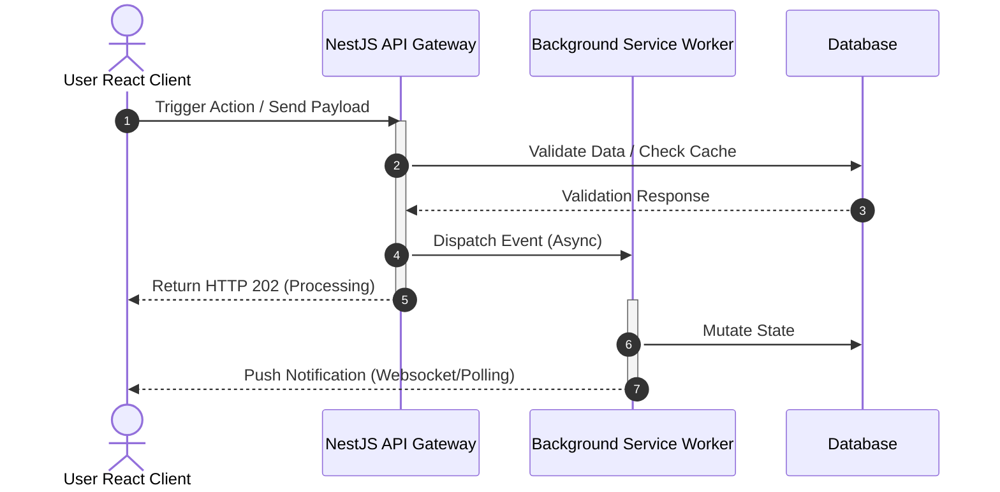

# Flow Sequence Architecture
*Version: ${VERSION}*

## Dynamic Data Flow (Sequence Diagram)

```mermaid
sequenceDiagram
  autonumber
  actor User as User React Client
  participant Gateway as NestJS API Gateway
  participant Worker as Background Service Worker
  participant DB as Database
  
  User->>Gateway: Trigger Action / Send Payload
  activate Gateway
  Gateway->>DB: Validate Data / Check Cache
  DB-->>Gateway: Validation Response
  Gateway->>Worker: Dispatch Event (Async)
  Gateway-->>User: Return HTTP 202 (Processing)
  deactivate Gateway
  
  activate Worker
  Worker->>DB: Mutate State
  Worker-->>User: Push Notification (Websocket/Polling)
  deactivate Worker
```
