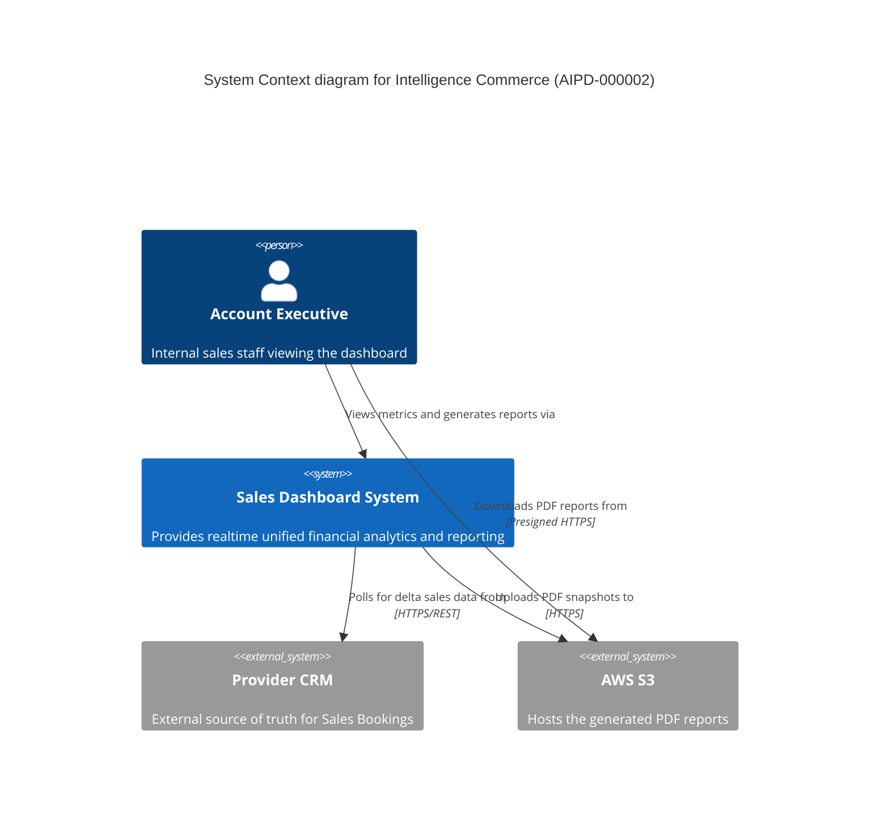

<!-- Knowledge Metadata
Feature-Code: AIPD-000002
Feature-Name: Sales Dashboard
Source-File: 003.Software Architecture Workflow/Strategic Architecture.md
Source-Version: 2026.04.03 14.29.29
Sections: System Context Diagram (Level 1)
-->

# **C4: System Context Diagram (AIPD-000002)**

