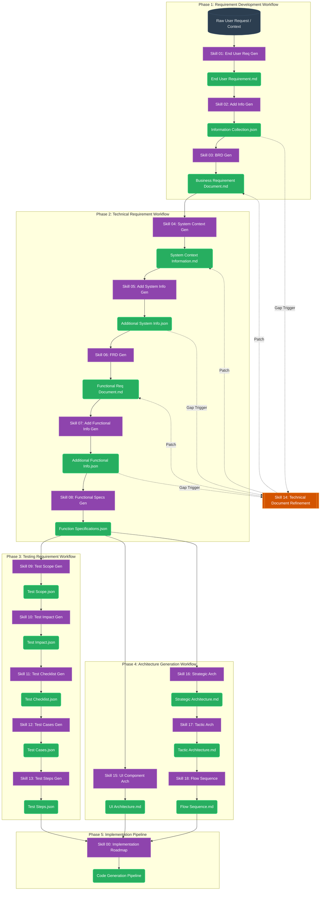

# Agentic OS: Document Generation Pipeline

This document visualizes the complete end-to-end autonomous documentation pipeline (Agentic OS), illustrating how specific Agent Skills trigger predefined Generation Rules to output highly structured architectural and functional artifacts.

---

## 1. Overall System Mindmap (Mermaid)

---

## 2. Component Pipeline Detailing

### 🟢 Phase 1: Requirement Development
Translates abstract user intents into formalized, validated Business rules.
- **Skill 01 `[End User Requirement Generation]`**: Outputs the initial base file (`End User Requirement.md`).
- **Skill 02 `[Additional Information Generation]`**: Scans the base file for logical business gaps, outputting questions in JSON format (`Information Collection.json`).
- **Skill 03 `[Business Requirement Document Generation]`**: Aggregates the previous documents to formulate the hardened `Business Requirement Document.md` containing strict BRs.

### 🔵 Phase 2: Technical Requirement
Converts Business Rules into flat, actionable Technical components and restrictions.
- **Skill 04 `[System Context Generation]`**: Defines Database schema patterns, Infrastructure SLA, and Architectural patterns (`System Context Information.md`).
- **Skill 05 `[Additional System Information Generation]`**: Finds Non-Functional Requirement gaps (`Additional System Information.json`).
- **Skill 06 `[Functional Requirement Document Generation]`**: Translates features into specific System Behaviors (`Functional Requirement Document.md`).
- **Skill 07 `[Additional Functional Information Generation]`**: Finds edge-cases in data isolation, race conditions, and payloads (`Additional Functional Information.json`).
- **Skill 08 `[Functional Specifications Generation]`**: Flattens ALL previous markdown logic into a strict Relational JSON structure, ready for database translation (`Function Specifications.json`).

### 🟠 Phase 3: Testing Requirement
Generates absolute automated testing boundaries mirroring the Functional Specifications.
- **Skill 09 `[Test Scope Generation]`**: Establishes In-Scope constraints across UI, API, worker modules (`Test Scope.json`).
- **Skill 10 `[Test Impact Generation]`**: Identifies Legacy impact risks (`Test Impact.json`).
- **Skill 11 `[Test Checklist Generation]`**: Translates Scopes + Impacts into specific testable action tasks (`Test Checklist.json`).
- **Skill 12 `[Test Cases Generation]`**: Expands the checklist into structural cases with Mocks (`Test Cases.json`).
- **Skill 13 `[Test Steps Generation]`**: Finalizes the steps to execute QA validation (`Test Steps.json`).

### 🟣 Phase 4: Architecture Generation
Draws specific architectural boundaries utilizing Mermaid flows.
- **Skill 15 `[UI Component Architecture Generation]`**: Builds Atomic component structures.
- **Skill 16 `[Strategic Architecture Generation]`**: Builds High-level C4 Contexts.
- **Skill 17 `[Tactic Architecture Generation]`**: Drills down into Vertical Slices.
- **Skill 18 `[Flow Sequence Generation]`**: Emits cross-component interaction logic.

### 🔨 Cross-Cutting / Refinement
- **Skill 14 `[Technical Document Refinement]`**: The "Surgeon" skill. It actively evaluates any "Additional Information .json" file and permanently patches the underlying markdown document to eliminate gaps.
- **Skill 00 `[Implementation Roadmap]`**: The ultimate downstream consumer that orchestrates actual `.js / .ts / .go` generation based on all preceding architectural artifacts.
