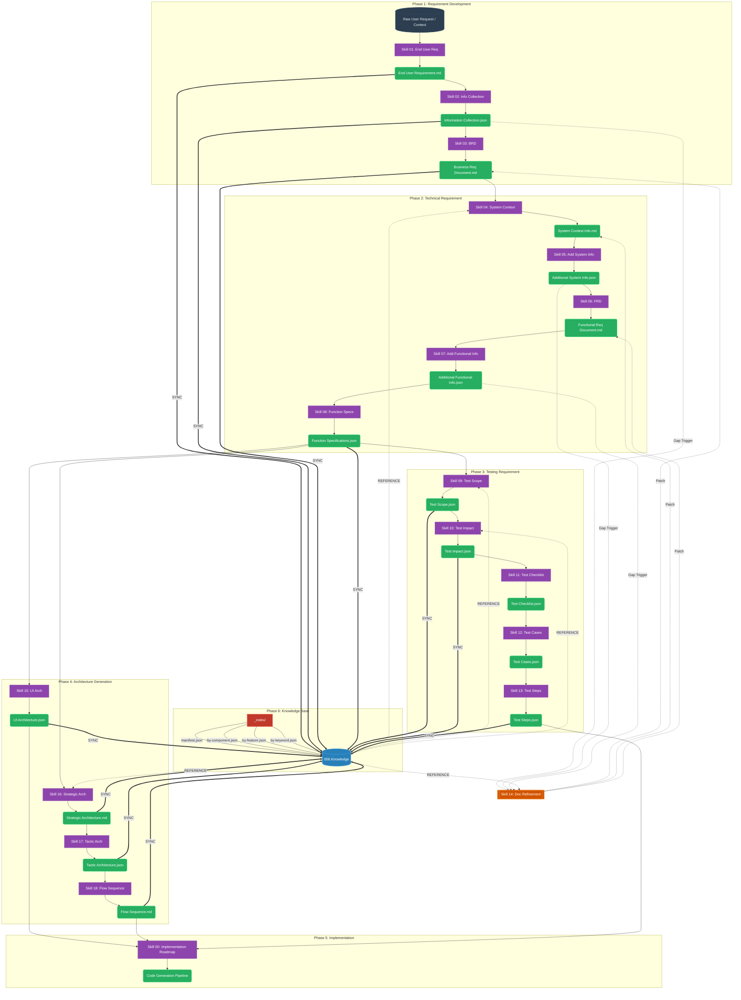
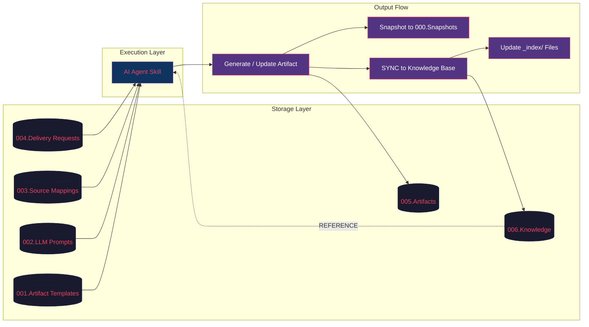
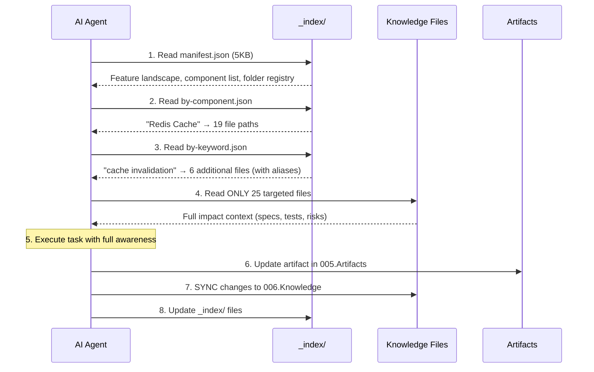

# Agentic OS: Document Generation & Knowledge Pipeline

This document visualizes the complete end-to-end autonomous documentation pipeline (Agentic OS), illustrating how Agent Skills generate structured artifacts, sync them into a searchable Knowledge Base, and leverage that knowledge for cross-feature impact analysis.

---

## 1. System Architecture Overview



---

## 2. Data Flow Architecture



---

## 3. Knowledge Base Architecture

```mermaid
graph TD
    classDef cat1 fill:#e74c3c,stroke:#c0392b,color:#fff;
    classDef cat2 fill:#3498db,stroke:#2980b9,color:#fff;
    classDef cat3 fill:#e67e22,stroke:#d35400,color:#fff;
    classDef cat4 fill:#e74c3c,stroke:#c0392b,color:#fff,stroke-dasharray: 5 5;
    classDef idx fill:#2c3e50,stroke:#34495e,color:#ecf0f1;

    IDX["_index/"]:::idx
    IDX --> MAN["manifest.json"]:::idx
    IDX --> COMP["by-component.json"]:::idx
    IDX --> FEAT["by-feature.json"]:::idx
    IDX --> KEY["by-keyword.json"]:::idx

    subgraph "what-we-build (WHY & WHAT)"
        K01["001. End User Requirement"]:::cat1
        K02["002. End User Information Collection"]:::cat1
        K03["003. Business Requirement Document"]:::cat1
    end

    subgraph "how-we-build (HOW)"
        K04["004. System Context Information"]:::cat2
        K05["005. Additional System Information"]:::cat2
        K06["006. Functional Requirement Document"]:::cat2
        K07["007. Additional Functional Information"]:::cat2
        K08["008. Function Specifications"]:::cat2
        K09["009. API Tactic Architecture"]:::cat2
        K10["010. Flow Sequence Architecture"]:::cat2
        K11["011. Strategic Architecture"]:::cat2
        K12["012. UI Component Architecture"]:::cat2
    end

    subgraph "how-we-test (HOW TO VERIFY)"
        K13["013. Test Cases"]:::cat3
        K14["014. Test Checklist"]:::cat3
        K16["016. Test Scope"]:::cat3
        K17["017. Test Steps"]:::cat3
    end

    subgraph "what-can-break (WHAT IF)"
        K15["015. Test Impact"]:::cat4
    end

    MAN --> K01 & K04 & K13 & K15
```



---

## 4. AI Agent Impact Analysis Flow



---

## 5. Skill-to-Knowledge Folder Mapping

Every Skill generates artifacts that are then decomposed and synced into specific Knowledge folders:

| Skill | Artifact Output | Knowledge Folder | Decomposition Strategy |
|---|---|---|---|
| Skill 01 | `End User Requirement.md` | `001. End User Requirement` | 1 file (whole document) |
| Skill 02 | `Information Collection.json` | `002. End User Information Collection` | Each JSON array item → 1 file |
| Skill 03 | `Business Requirement Document.md` | `003. Business Requirement Document` | Split by section → 4 files |
| Skill 04 | `System Context Information.md` | `004. System Context Information` | Split by section → 5 files |
| Skill 05 | `Additional System Information.json` | `005. Additional System Information` | Each JSON array item → 1 file |
| Skill 06 | `Functional Requirement Document.md` | `006. Functional Requirement Document` | Split by section → 4 files |
| Skill 07 | `Additional Functional Information.json` | `007. Additional Functional Information` | Each JSON array item → 1 file |
| Skill 08 | `Function Specifications.json` | `008. Function Specifications` | 2 files (JSON + MD) |
| Skill 09 | `Test Scope.json` | `016. Test Scope` | Each JSON array item → 1 file |
| Skill 10 | `Test Impact.json` | `015. Test Impact` | Each JSON array item → 1 file |
| Skill 11 | `Test Checklist.json` | `014. Test Checklist` | Each JSON array item → 1 file |
| Skill 12 | `Test Cases.json` | `013. Test Cases` | Each JSON array item → 1 file |
| Skill 13 | `Test Steps.json` | `017. Test Steps` | Each TES-CAS group → 1 file |
| Skill 14 | *(patches existing docs)* | *(re-syncs affected folder)* | Re-generate affected knowledge files |
| Skill 15 | `UI Component Architecture.json` | `012. UI Component Architecture` | Split by Atomic level → 5 files |
| Skill 16 | `Strategic Architecture.md` | `011. Strategic Architecture` | Split by C4 level → 2 files |
| Skill 17 | `API Tactic Architecture.json` | `009. API Tactic Architecture` | Each Vertical Slice → 1 file |
| Skill 18 | `Flow Sequence Architecture.md` | `010. Flow Sequence Architecture` | Each Mermaid diagram → 1 file |

---

## 6. Component Pipeline Detailing

### 🟢 Phase 1: Requirement Development
Translates abstract user intents into formalized, validated Business rules.
- **Skill 01 `[End User Requirement Generation]`**: Outputs the initial base file (`End User Requirement.md`).
- **Skill 02 `[Additional Information Generation]`**: Scans the base file for logical business gaps, outputting questions in JSON format (`Information Collection.json`).
- **Skill 03 `[Business Requirement Document Generation]`**: Aggregates the previous documents to formulate the hardened `Business Requirement Document.md` containing strict BRs.

### 🔵 Phase 2: Technical Requirement
Converts Business Rules into flat, actionable Technical components and restrictions.
- **Skill 04 `[System Context Generation]`**: Defines Database schema patterns, Infrastructure SLA, and Architectural patterns (`System Context Information.md`).
- **Skill 05 `[Additional System Information Generation]`**: Finds Non-Functional Requirement gaps (`Additional System Information.json`).
- **Skill 06 `[Functional Requirement Document Generation]`**: Translates features into specific System Behaviors (`Functional Requirement Document.md`).
- **Skill 07 `[Additional Functional Information Generation]`**: Finds edge-cases in data isolation, race conditions, and payloads (`Additional Functional Information.json`).
- **Skill 08 `[Functional Specifications Generation]`**: Flattens ALL previous markdown logic into a strict Relational JSON structure, ready for database translation (`Function Specifications.json`).

### 🟠 Phase 3: Testing Requirement
Generates absolute automated testing boundaries mirroring the Functional Specifications.
- **Skill 09 `[Test Scope Generation]`**: Establishes In-Scope constraints across UI, API, worker modules (`Test Scope.json`).
- **Skill 10 `[Test Impact Generation]`**: Identifies Legacy impact risks (`Test Impact.json`). Reads `by-component.json` for cross-feature risk correlation.
- **Skill 11 `[Test Checklist Generation]`**: Translates Scopes + Impacts into specific testable action tasks (`Test Checklist.json`).
- **Skill 12 `[Test Cases Generation]`**: Expands the checklist into structural cases with Mocks (`Test Cases.json`).
- **Skill 13 `[Test Steps Generation]`**: Finalizes the steps to execute QA validation (`Test Steps.json`).

### 🟣 Phase 4: Architecture Generation
Draws specific architectural boundaries utilizing Mermaid flows.
- **Skill 15 `[UI Component Architecture Generation]`**: Builds Atomic component structures (Atoms → Molecules → Organisms → Templates → Pages).
- **Skill 16 `[Strategic Architecture Generation]`**: Builds High-level C4 Contexts (Level 1: System Context, Level 2: Container Diagram).
- **Skill 17 `[Tactic Architecture Generation]`**: Drills down into Vertical Slices (module → controller → handler → repository).
- **Skill 18 `[Flow Sequence Generation]`**: Emits cross-component interaction logic (Mermaid Sequence Diagrams).

### 🔨 Phase 5: Cross-Cutting / Refinement
- **Skill 14 `[Technical Document Refinement]`**: The "Surgeon" skill. Evaluates any "Additional Information .json" file and permanently patches the underlying markdown document to eliminate gaps. After patching, re-syncs affected Knowledge files.
- **Skill 00 `[Implementation Roadmap]`**: The ultimate downstream consumer that orchestrates actual `.js / .ts / .go` generation based on all preceding architectural artifacts.

### 🧠 Phase 6: Knowledge Base (NEW)
The production-ready, searchable knowledge layer that accumulates and indexes all artifacts for AI-powered impact analysis.

**Bidirectional Flow:**
- **KNOWLEDGE SYNC** (Artifact → Knowledge): After every Skill generates an artifact, the output is decomposed into granular, searchable files in `006.Knowledge/`.
- **KNOWLEDGE REFERENCE** (Knowledge → Skill): Before generating, Skills consult `_index/` files to ensure consistency with existing knowledge across all features.

**Index Layer (`_index/`):**
| Index File | Purpose | Query Example |
|---|---|---|
| `manifest.json` | Master entry point — feature registry, categories, folder map | *"What features exist? What components?"* |
| `by-component.json` | Component → file paths mapping (10 components) | *"If Redis changes, what files are affected?"* → 19 files |
| `by-feature.json` | Feature → categorized file listing | *"Show all AIPD-000002 knowledge"* → 66 files |
| `by-keyword.json` | Keyword → file paths with semantic aliases (13 groups) | *"cache invalidation"* → 6 files (also matches "SCAN UNLINK", "eviction") |

**Knowledge Categories:**
| Category | Question it Answers | Folders | Files |
|---|---|---|---|
| `what-we-build` | WHY & WHAT | 001 – 003 | 9 |
| `how-we-build` | HOW | 004 – 012 | 35 |
| `how-we-test` | HOW TO VERIFY | 013, 014, 016, 017 | 22 |
| `what-can-break` | WHAT IF | 015 | 4 |

---

## 7. File Naming Conventions

### Artifacts (`005.Develop.002.Artifacts`)
```
${REQUEST CODE}/
├── 001.Requirement Development Workflow/
│   ├── End User Requirement.md
│   ├── Information Collection.json
│   ├── Business Requirement Document.md
│   └── 000.Snapshots/           ← Version history
├── 002.Technical Requirement Workflow/
│   └── ...
├── 003.Testing Requirement Workflow/
│   └── ...
└── 003.Software Architecture Workflow/
    └── ...
```

### Knowledge Files (`006.Knowledge`)
```
006.Knowledge/
├── _index/                      ← AI Agent reads FIRST
│   ├── manifest.json            ← Entry point
│   ├── by-component.json        ← Impact analysis
│   ├── by-feature.json          ← Feature scope
│   └── by-keyword.json          ← Semantic search
├── 001. End User Requirement/
│   └── AIPD-000002.end-user-requirement.md
├── 002. End User Information Collection/
│   ├── AIPD-000002.INF-000001.fiscal-calendar-boundaries.json
│   ├── AIPD-000002.INF-000002.timezone-aggregation-standards.json
│   └── ...
├── ...
└── 017. Test Steps/
    └── AIPD-000002.TES-000001.CAS-000001.date-range-365.json
```

**Naming Pattern:** `${FEATURE_CODE}.${ARTIFACT_CODE}.${descriptive-slug}.{json|md}`

**Metadata Headers:**
- **Markdown**: HTML comment block with `Feature-Code`, `Source-File`, `Source-Version`
- **JSON**: `_metadata` object with `featureCode`, `featureName`, `sourceFile`, `sourceVersion`

---

## 8. Execution Protocol

When an AI Agent receives a task, it follows this protocol:

```
1. RECEIVE task from user
2. READ Source Mapping Instructions (003.Setup.003)
   ├── Understand INPUT SOURCE FILES
   ├── Understand GENERATION RULES
   ├── Understand KNOWLEDGE REFERENCE    ← NEW
   └── Understand KNOWLEDGE SYNC RULES   ← NEW
3. READ LLM Prompt Template (002.Setup.002)
   ├── Adopt persona (Product Owner, Architect, QA Engineer, etc.)
   └── Knowledge Base Awareness section  ← NEW
4. REFERENCE Knowledge Base (006.Knowledge/_index/)
   ├── manifest.json → landscape awareness
   ├── by-component.json → component consistency
   └── by-keyword.json → semantic consistency
5. GENERATE artifact in 005.Develop.002.Artifacts
   ├── Snapshot previous version to 000.Snapshots/
   └── Write new versioned artifact
6. SYNC to Knowledge Base (006.Knowledge/)
   ├── Decompose artifact into granular knowledge files
   ├── Apply naming convention & metadata headers
   └── Update _index/ files (manifest, component, feature, keyword)
7. REPORT completion
```
