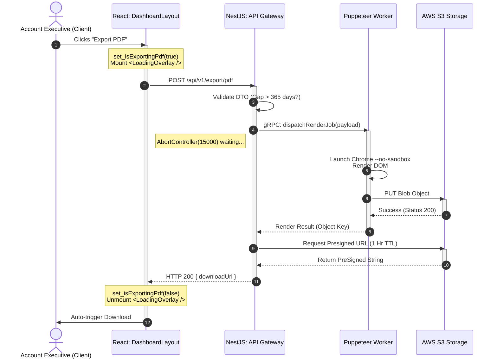
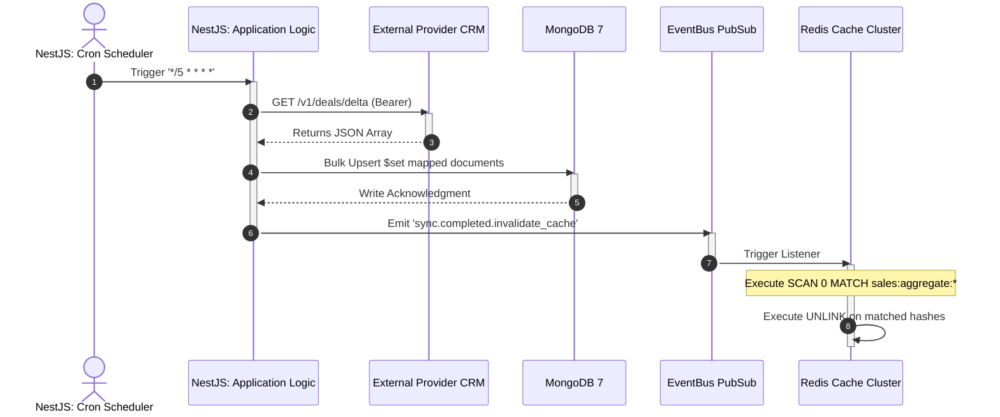

# Flow Sequence Architecture
*Request Version: 2026.04.03 14.29.29*

## 1. Synchronous vs Asynchronous PDF Generation Flow
This diagram models the explicit race conditions managed by the `AbortController` against distant generic RPC executions.

## 2. Background Poller & Distributed Cache Invalidation
This diagram models the headless distributed synchronization architecture.

