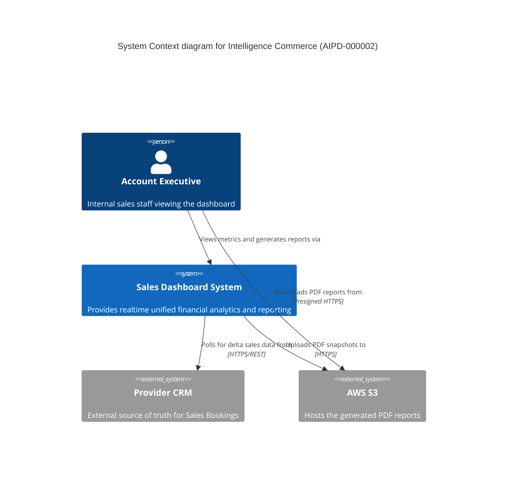
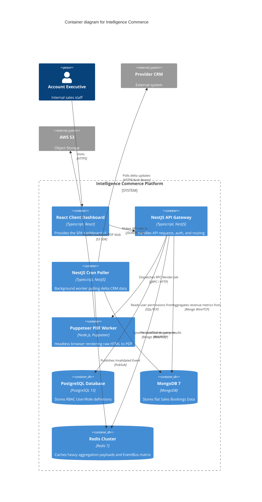

# Strategic Design (C4 Model)
*Request Version: 2026.04.03 14.29.29*

## 1. System Context Diagram (Level 1)

```mermaid
C4Context
  title System Context diagram for Intelligence Commerce (AIPD-000002)
  
  Person(ae, "Account Executive", "Internal sales staff viewing the dashboard")
  System(dashboard, "Sales Dashboard System", "Provides realtime unified financial analytics and reporting")
  System_Ext(crm, "Provider CRM", "External source of truth for Sales Bookings")
  System_Ext(s3, "AWS S3", "Hosts the generated PDF reports")

  Rel(ae, dashboard, "Views metrics and generates reports via")
  Rel(dashboard, crm, "Polls for delta sales data from", "HTTPS/REST")
  Rel(dashboard, s3, "Uploads PDF snapshots to", "HTTPS")
  Rel(ae, s3, "Downloads PDF reports from", "Presigned HTTPS")
```

## 2. Container Diagram (Level 2)

```mermaid
C4Container
  title Container diagram for Intelligence Commerce
  
  Person(ae, "Account Executive", "Internal sales staff")
  System_Ext(crm, "Provider CRM", "External system")
  System_Ext(s3, "AWS S3", "Object Storage")

  System_Boundary(aipd, "Intelligence Commerce Platform") {
    Container(react_app, "React Client Dashboard", "Typescript, React", "Provides the SPA dashboard UI")
    Container(api_gateway, "NestJS API Gateway", "Typescript, NestJS", "Handles API requests, auth, and routing")
    Container(cron_poller, "NestJS Cron Poller", "Typescript, NestJS", "Background worker pulling delta CRM data")
    Container(puppeteer, "Puppeteer PDF Worker", "Node.js, Puppeteer", "Headless browser rendering raw HTML to PDF")
    
    ContainerDb(postgres, "PostgreSQL Database", "PostgreSQL 15", "Stores RBAC User/Role definitions")
    ContainerDb(mongo, "MongoDB 7", "MongoDB", "Stores flat Sales Bookings Data")
    ContainerDb(redis, "Redis Cluster", "Redis 7", "Caches heavy aggregation payloads and EventBus matrix")
  }

  Rel(ae, react_app, "Visits", "HTTPS")
  Rel(react_app, api_gateway, "Makes API calls to", "JSON/HTTPS")
  
  Rel(api_gateway, postgres, "Reads user permissions from", "SQL/TCP")
  Rel(api_gateway, mongo, "Aggregates revenue metrics from", "Mongo Wire/TCP")
  Rel(api_gateway, redis, "Fetches/Stores query results", "RESP/TCP")
  Rel(api_gateway, puppeteer, "Dispatches RPC Render Job", "gRPC / HTTP")
  
  Rel(cron_poller, crm, "Polls delta updates", "HTTPS/Auth Bearer")
  Rel(cron_poller, mongo, "Upserts sanitized documents", "Mongo Wire/TCP")
  Rel(cron_poller, redis, "Publishes Invalidated Event", "PubSub")
  
  Rel(puppeteer, s3, "Pushes rendered PDF blob", "S3 SDK")
```
