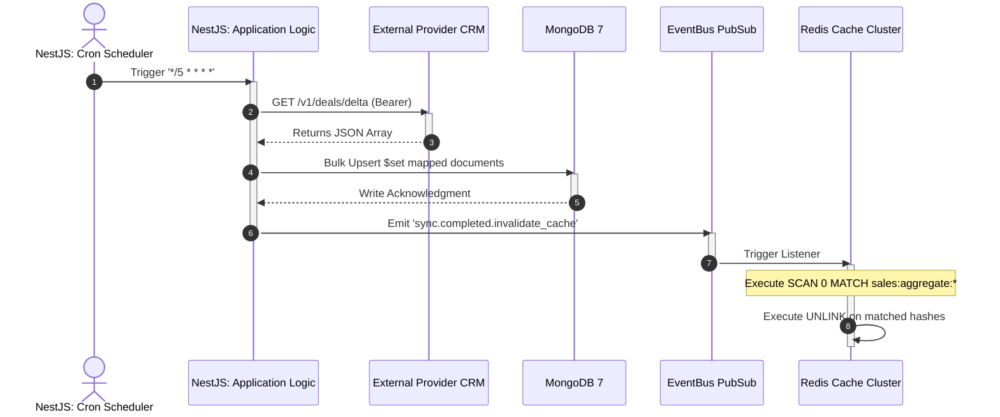

<!-- Knowledge Metadata
Feature-Code: AIPD-000002
Feature-Name: Sales Dashboard
Source-File: 003.Software Architecture Workflow/Flow Sequence Architecture.md
Source-Version: 2026.04.03 14.29.29
Sections: Background Poller & Distributed Cache Invalidation
-->

# **Flow: Background Cache Invalidation (AIPD-000002)**

## Background Poller & Distributed Cache Invalidation
This diagram models the headless distributed synchronization architecture.

