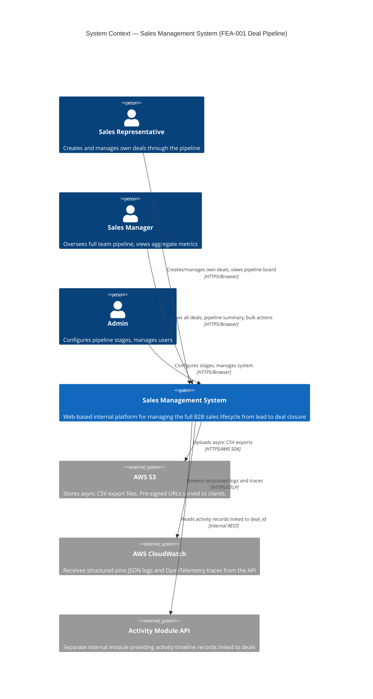
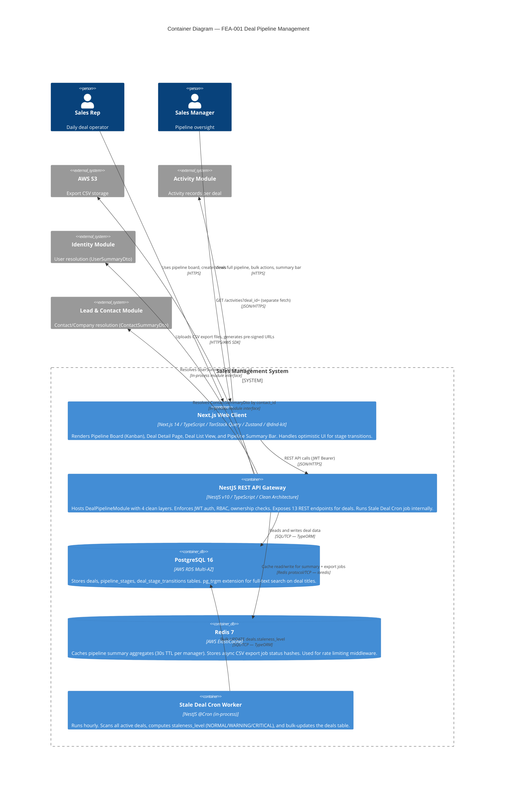
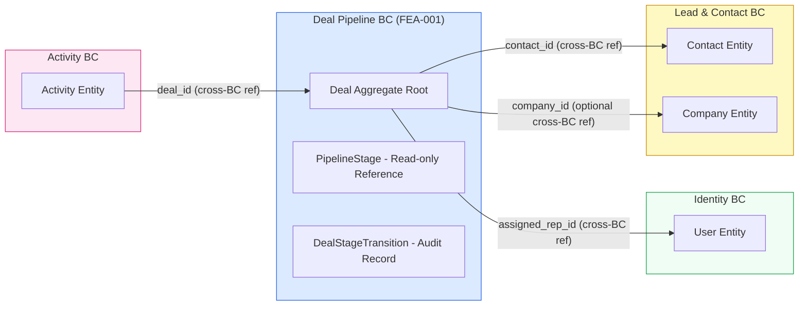
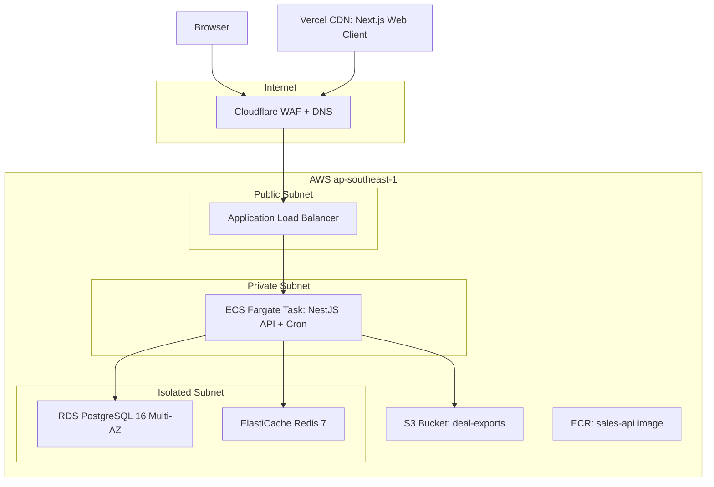

# Strategic Design (C4 Model)
*Version: 2026.04.06 21.00.00*
*Feature: FEA-001 — Deal Pipeline Management*

---

## Context Diagram (Level 1)

---

## Container Diagram (Level 2)

---

## Bounded Context Map

---

## Deployment Architecture

