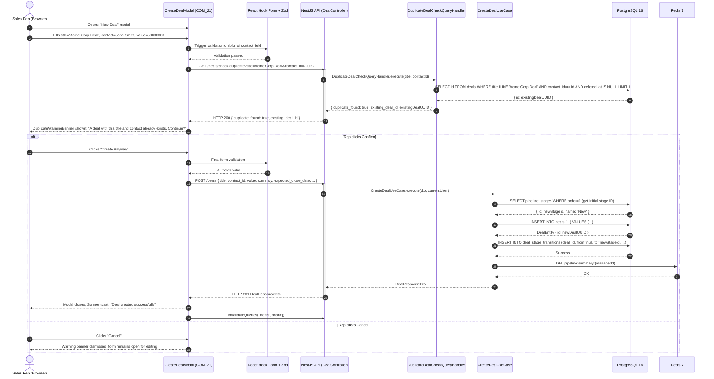
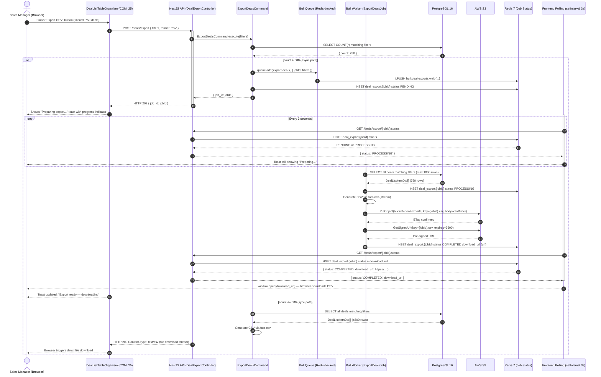
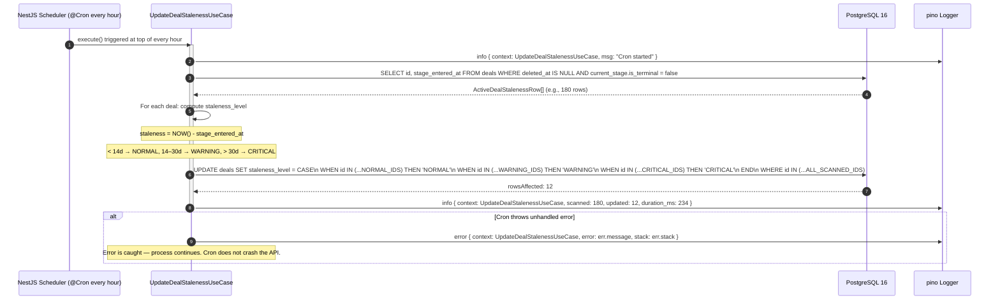

# Flow Sequence Architecture
*Version: 2026.04.06 21.00.00*
*Feature: FEA-001 — Deal Pipeline Management*

---

## Flow 1: Deal Stage Transition (Drag-and-Drop with Optimistic UI + Rollback)

```mermaid
sequenceDiagram
  autonumber
  actor Rep as Sales Rep (Browser)
  participant Board as PipelineBoardTemplate (COM_27)
  participant Store as usePipelineBoardStore (Zustand)
  participant Query as TanStack Query (useDealsBoard)
  participant API as NestJS API (DealController)
  participant UC as TransitionDealStageUseCase
  participant DB as PostgreSQL 16
  participant Redis as Redis 7 (Cache)

  Rep->>Board: Drags DealCard from "Qualified" to "Proposal Sent"
  Board->>Store: addPending(dealId, targetStageId)
  Board->>Store: moveCard(dealId, fromStageId, toStageId) [optimistic]
  Board-->>Rep: Card visually moves to "Proposal Sent" column instantly

  Board->>API: PATCH /deals/{id}/stage { target_stage_id }
  activate API
  API->>UC: TransitionDealStageUseCase.execute(dealId, targetStageId, currentUser)

  UC->>DB: SELECT deal WHERE id = dealId
  DB-->>UC: DealEntity { current_stage: Qualified, is_terminal: false }

  UC->>DB: SELECT pipeline_stages ORDER BY order
  DB-->>UC: [New(1), Qualified(2), Proposal Sent(3), Negotiation(4), CW(5,terminal), CL(6,terminal)]

  alt Valid transition (Qualified → Proposal Sent, order=3 follows order=2)
    UC->>DB: BEGIN TRANSACTION
    UC->>DB: UPDATE deals SET current_stage_id=proposalId, stage_entered_at=NOW()
    UC->>DB: INSERT deal_stage_transitions (deal_id, from=qualified, to=proposal, by=repId, at=NOW())
    UC->>DB: COMMIT
    DB-->>UC: Success
    UC->>Redis: DEL pipeline:summary:{managerId}
    Redis-->>UC: OK
    UC-->>API: DealResponseDto (updated)
    API-->>Board: HTTP 200 DealResponseDto
    deactivate API
    Board->>Store: removePending(dealId)
    Board->>Query: invalidateQueries(['deals','board'])
    Query->>API: GET /deals/board (re-fetch)
    API-->>Query: Updated PipelineBoardResponseDto
    Board-->>Rep: Board reconciled with server state

  else Invalid transition (e.g., skip to Negotiation)
    UC-->>API: throw UnprocessableEntityException { error_code: INVALID_STAGE_TRANSITION, allowed_next_stages }
    API-->>Board: HTTP 422 { error_code, from_stage, allowed_next_stages }
    deactivate API
    Board->>Store: rollbackPending(dealId) [revert to Qualified column]
    Board-->>Rep: Card snaps back to "Qualified" with CSS transition
    Board-->>Rep: Sonner toast error: "Stage transition failed: Must go through Proposal Sent first"

  else Deal is in terminal stage
    UC-->>API: throw UnprocessableEntityException { error_code: DEAL_STAGE_TERMINAL }
    API-->>Board: HTTP 422 { error_code: DEAL_STAGE_TERMINAL }
    deactivate API
    Board->>Store: rollbackPending(dealId)
    Board-->>Rep: Card reverts, toast error: "This deal is closed and cannot be moved"
  end
```

---

## Flow 2: Create Deal with Duplicate Check



---

## Flow 3: Pipeline Summary Cache-Aside with Invalidation

```mermaid
sequenceDiagram
  autonumber
  actor Manager as Sales Manager (Browser)
  participant SummaryBar as PipelineSummaryBarOrganism (COM_24)
  participant TQ as TanStack Query (usePipelineSummary, refetchInterval=30s)
  participant API as NestJS API (DealSummaryController)
  participant QH as GetPipelineSummaryQueryHandler
  participant Redis as Redis 7
  participant DB as PostgreSQL 16

  note over TQ: Auto-refetch triggered every 30 seconds

  TQ->>API: GET /deals/summary (with active filters)
  activate API
  API->>QH: GetPipelineSummaryQueryHandler.execute(managerId, filters)

  QH->>Redis: GET pipeline:summary:{managerId}

  alt Cache HIT
    Redis-->>QH: Cached JSON { total_active_deals, total_pipeline_value, win_rate, ... }
    QH-->>API: PipelineSummaryResponseDto (cached_at = original write time)
    API-->>TQ: HTTP 200 PipelineSummaryResponseDto
    deactivate API
    TQ-->>SummaryBar: Renders metrics instantly

  else Cache MISS (first load or TTL expired)
    Redis-->>QH: null
    QH->>DB: SELECT COUNT(*) active deals (no terminal stage, deleted_at IS NULL)
    DB-->>QH: { total_active_deals: 47 }
    QH->>DB: SELECT SUM(value) FROM deals WHERE active
    DB-->>QH: { total_pipeline_value: 2340000000 }
    QH->>DB: SELECT current_stage_id, SUM(value) GROUP BY current_stage_id WHERE active
    DB-->>QH: value_by_stage[]
    QH->>DB: SELECT COUNT(*) Closed Won + Closed Lost last 30 days
    DB-->>QH: { won: 12, lost: 5 }
    QH->>DB: SELECT AVG(closed_at - created_at) for Closed Won last 30 deals
    DB-->>QH: { avg_cycle_time_days: 18.4 }
    QH->>Redis: SET pipeline:summary:{managerId} {serialized} EX 30
    Redis-->>QH: OK
    QH-->>API: PipelineSummaryResponseDto
    API-->>TQ: HTTP 200 PipelineSummaryResponseDto
    deactivate API
    TQ-->>SummaryBar: Renders up-to-date metrics
  end

  note over API, Redis: Concurrent write operation (e.g., Rep transitions a deal)
  API->>Redis: DEL pipeline:summary:{managerId}
  Redis-->>API: OK (cache invalidated)
  note over TQ: Next 30s poll will trigger Cache MISS path and return fresh data
```

---

## Flow 4: Async CSV Export (>500 rows)



---

## Flow 5: Stale Deal Cron Execution


